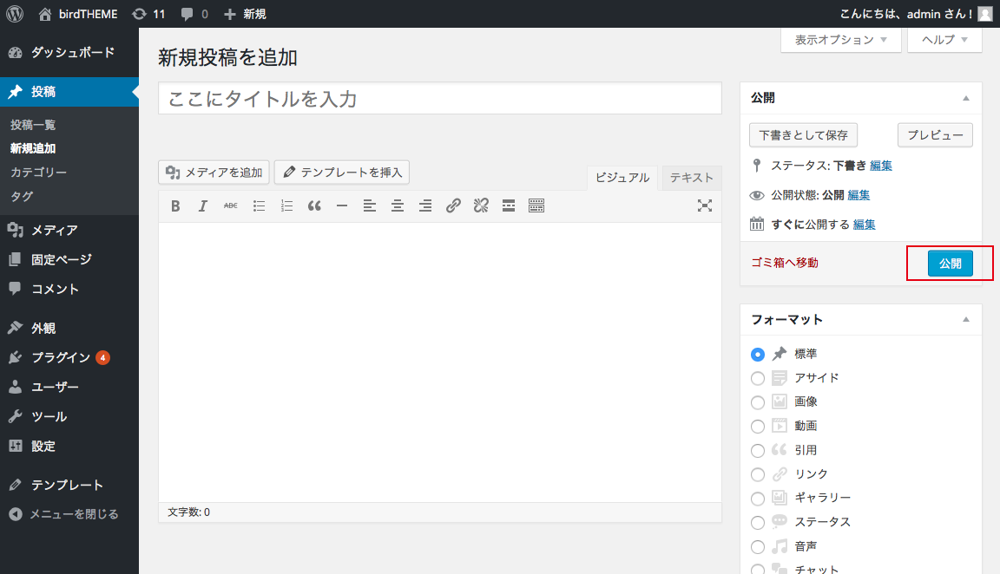

# 新規投稿を追加

記事のタイトルを入力します

本文を入力します

「公開」ボタンをクリックします

すぐに公開しない場合は「下書きとして保存」をクリックします

2 [投稿方法]({{ site.baseurl }}/2_toukou/)

2-1 投稿方法 - 見出しをつける

2-2 [投稿方法 - 画像を添付する]({{ site.baseurl }}/2_toukou/index-2.html)