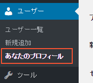

# ユーザ

## プロフィール設定

### パスワード変更

ダッシュボードのメニューにあります「ユーザー」の中から「あなたのプロフィール」をクリックします。

プロフィール画面が表示されますので、「アカウント管理」の中にあります「新しいパスワード」の横の「パスワードの生成」ボタンをクリックします。

パスワードを入力するウィンドウが表示されますので、新しいパスワードを入力します。

入力しましたら「プロフィールを更新」ボタンをクリックします。

### メールアドレス変更

### ニックネーム

## ユーザの追加
